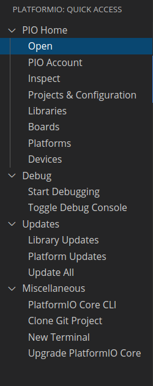
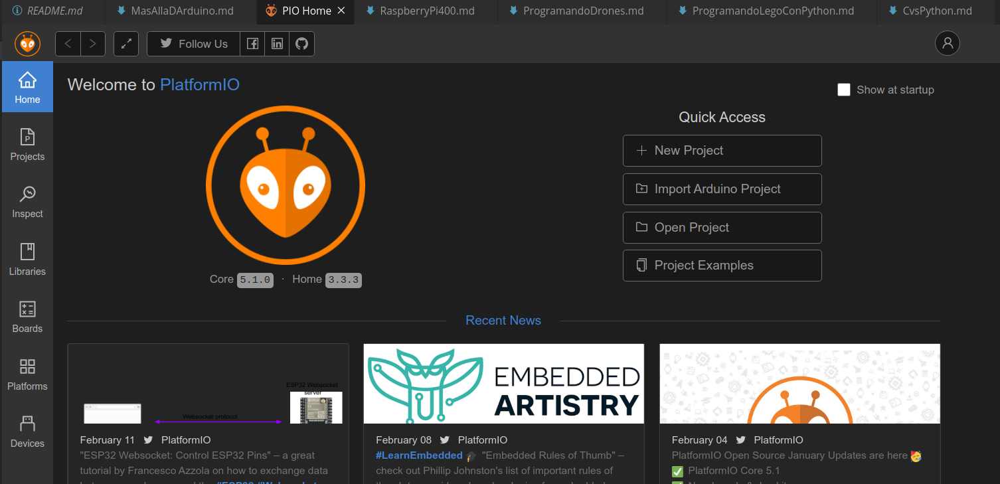
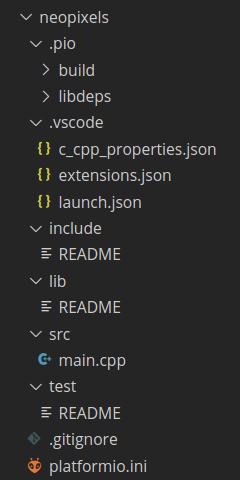

## Más allá de Arduino


### IDE -> Extensión Arduino

* Es una frontend del IDE de Arduino, que tenemos que tener instalado.
* Es una mejora porque nos proporciona
    * Un editor mucho más potente
    * Autocompletado de código
    * Integración con herramientas de gestión de código como git/github
    * Facilidad de uso si ya hemos trabajado con el IDE de Arduino

Desventajas:
* Sigue siendo el mismo Arduino
* Tiene algunos fallos, como el error al seleccionar el puerto

### IDE -> Plataformio

#### ¿Qué es platformIO?

Es un entorno pensado para trabajar con diferentes plataformas: Arduino, esp8266, ESP32, SMT32...

En algunos de ellos, como en ESP, permite seleccionar con cuál SDK queremos trabajar

#### Uso

Podemos usarlo desde varios editores, usaremos Visual Studio Code, que supondremos que ya está instalado

* Instalamos la extensión Plataformio (que instala la de C++ si no la teníamos ya)
* Nos aparece el icono para activarlo 
* Al pulsarlo nos aparece el menú lateral 
     
    Desde el que podemos acceder a todas las opciones.
* Si pulsamos en Home (desde el menú lateral o desde la casita que aparece en la status bar), accedemos a la pantalla principal desde la que podemos hacer casi todo

* Crear proyecto
* Importar proyecto


#### Estructura de cada proyecto



#### Añadir librerías
Podemos añadirlas desde la pantalla inicial de Plataformio, seleccionando la librería y a qué proyecto se la añadimos
También podemos añadir la librería directamente a las dependencias del fichero plataformio.ini

```
 lib_deps = Wire
```


#### Recursos

[Tutorial DroneBot](https://dronebotworkshop.com/platformio/)

[Documentación](https://docs.platformio.org/en/latest/)

